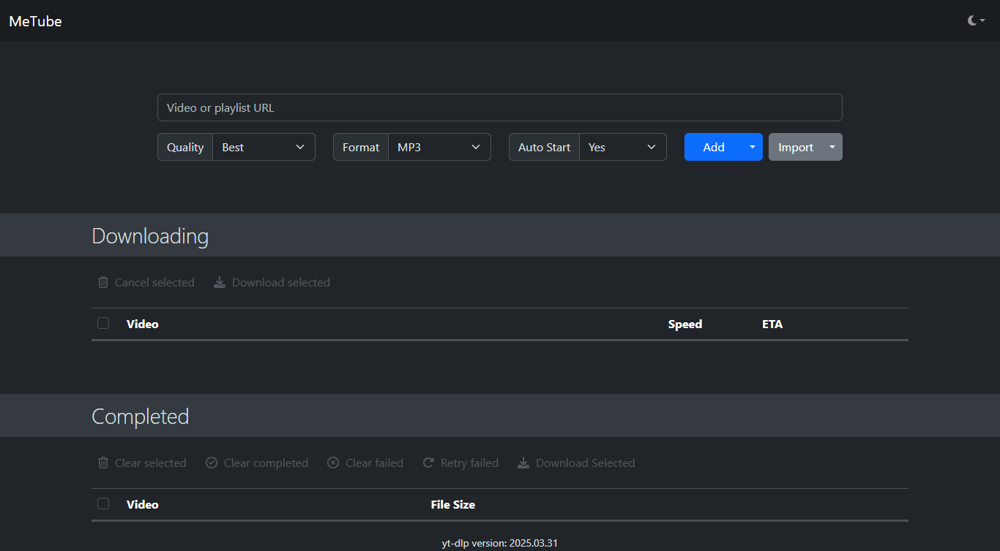

# 🎬 MeTube App

**MeTube App** is a self-hosted media downloader with a clean web interface — built to easily grab videos or audio from platforms like YouTube. It runs entirely in Docker, keeping your system clean and setup minimal.

> ⚙️ Built with Docker · 💻 Clean UI · 📁 Local Media Storage · 🧩 Powered by yt-dlp

---

## 📸 Preview

<p align="center">
  
</p>

---

## 🧰 Setup & Usage

This project uses **Docker only** — no Python or Node.js needs to be installed locally.

### ✅ Requirements

- [Docker](https://www.docker.com/products/docker-desktop)
- [Docker Compose](https://docs.docker.com/compose/)

### 🚀 Run the App

```bash
git clone https://github.com/tmsnobrega/metube-app.git
cd metube-app
docker compose up -d
```

Then open your browser and go to:  
➡️ [http://localhost:8081](http://localhost:8081)

---

## 📂 Downloads Folder

- All media is downloaded into the `downloads/` directory.
- The **folder is tracked** in GitHub (for structure), but its **contents are excluded** via `.gitignore`.
- This setting (download location) can be changed by modifying the volume paths in your `docker-compose.yml`.

---

## 🗂️ Project Structure

```
metube-app/
├── downloads/             # Media downloads
├── docker-compose.yml     # Docker setup and config
└── README.md              
```

---

## 📜 License

This project uses the [MIT License](LICENSE).

---

## 🙏 Credits

- Based on [alexta69/metube](https://github.com/alexta69/metube)
- Uses [yt-dlp](https://github.com/yt-dlp/yt-dlp) under the hood

---

<p align="center">
  <em>Built with Docker for a clean, modern, and minimal experience.</em>
</p>
